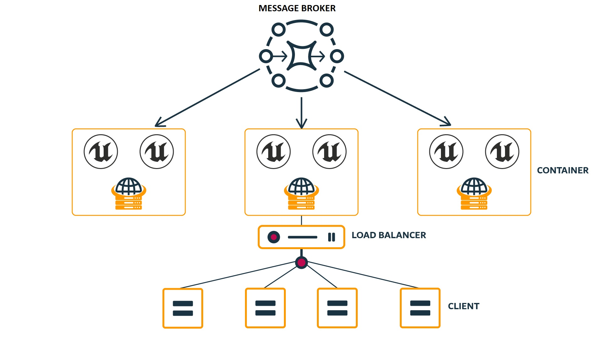
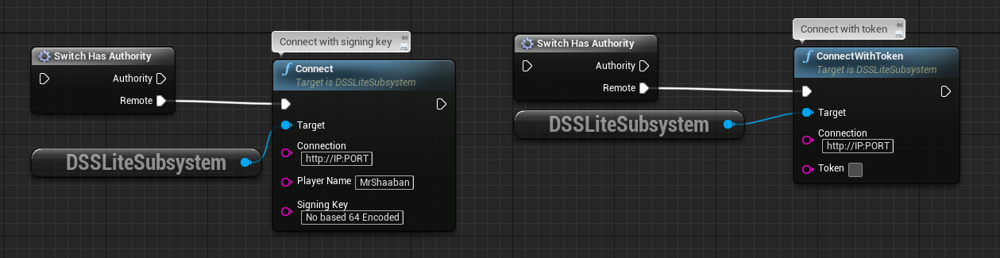
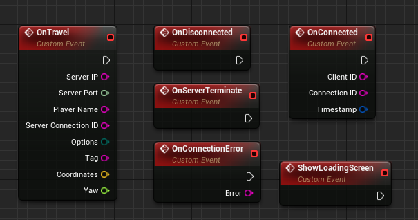
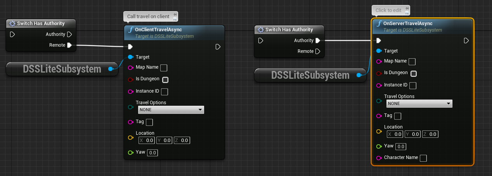

<h1 align="center">
  <br>
    
  <br>
  Dynamic Servers Sub-system
  <br>
</h1>

# Dynamic servers Sub-system

Dynamic servers sub-system is a plugin that helps in scaling your game players to the order of thousands by providing horizontally scalable approach, benefiting from latest cloud technology. [Demo Project](https://github.com/sha3sha3/UE-DynamicServersSystem)
<h1 align="center">
  <br>
    
  <br>
  Dynamic Servers Sub-system Architecture
  <br>
</h1>

# Support this project by buying a license on [Unreal Marketplace](https://www.unrealengine.com/marketplace/en-US/product/dynamic-servers-sub-system). 

# DSS Features

Dynamic servers system provides bunch of features and advantages such as:
```
1. Horizontal scalability
2. Easy to use (Plug and play)
3. Dynamic player spawning locations(Based on forward vector or predefined)
4. Time synchronization accross servers
5. Dungeon instantiation
6. Multi-regional servers
7. Full Blueprints support
8. Auto scale-in to save resource
9. JWT Authorization
10. per-Level players limit
```
# DSS Supported Servers
```
1. Windows x86_64
2. Linux x86_64
3. Linux ARM64
```
# DSS Supported Clients
```
1. Windows x86_64
2. Linux x86_64
3. Android
4. IOS 'Not tested!!'
```
# Connecting to DSS Server Node With Signing key(Not recommended)
Only on client you are responsible for the connection with DSS server, On Dedicated servers it is automated.
Since the token is generated locally (Not a good idea), if there is a time difference between client and server your token might be already expired. Thus you might get 401 Unauthorized. 

<h1 align="Center">
  <br>
    
</h1>

```
1. Connection: Http://LoadBalancerIP:Port
2. PlayerName: Players character name
3. Signing key: Non Base64 Encoded signing Key should be used same as server
```
# Connecting to DSS Server Node With Token(Recommended)

If you have your own authorization server that generates JWT token make sure to sign the token using HS256 algorithm.
Include the following claims:

```
1. "role": "client"
2. "name": <"player character name">
3. "exp": <unix expiration timestamp>
```

Please refer to the following site to verify your token 
[JWTIO](https://jwt.io/)

# Delegates

DSS supports a bunch of delegates that helps you build your game easily

<h1 align="Center">
  <br>
    
  <br>
</h1>

### OnTravel
Called after server respond to Travel

```
1. ServerIP: Virtual machine Ip where to connect
2. ServerPort: UE4 Server port
3. PlayerName: Character name that requested the travel
4. ServerConnectionID: Unique UE4 server ID could be used with servers communication
5. Other coordinates corrisponds to the spwaning location
```
### OnDisconnected
Called after UE4Server/Client disconnects from DSS Server

### OnServerTerminate
Called by DSS Server on UE4 Server to request server shutdown

### OnConnectionError
Called when connection attempt failed with Error message

### OnConnected
Called on Client and UE Server after connecting to DSS Server

```
1. ClientID: Unique client/server ID
2. ConnectionID: Unique connection ID
3. Timestamp: Time synchronization across all UE4 Servers
```

### ShowLoadingScreen
Called on Travel to show loading screen

# Travel Nodes
Travel node could be called from client side or from server side(with player character name)

<h1 align="Center">
  <br>
    
  <br>
</h1>

```
1. MapName: MapName and full path of where to connect the player
2. IsDungeon: Self explanatory
3. InstanceID: Dungeon InstanceID to connect to in case IsDungeon is true
4. TravelOptions: where to spawn player (None,Coordinate,Tag )
5. Tag: Player start tag if Travel Options set tot Tag
6. Location: where to spawn the player if Coordinates TravelOptions selected
7. Yaw: Rotation around Z-Axis Coordinates TravelOptions selected
```
# DSS Server Configuration
<a href="https://drive.google.com/file/d/1p-Sp_CeG9XrYAd8MWJWMALSlZ4DPKTBM/view">Download DSS Server.</a>
Make sure to have Curl and Telnet installed on your server

```json
{
  "AllowedHosts": "*",
  "Redis": {
    "IsEnabled": false,
    "Host": "deactivated right now",
    "Port": 14221,
    "Password": ""
  },
  "UE4Servers": {
    "Path": "UEServer Path",
    "Name": "UE Server name",
    "Port": 7770,
    "Levels": [
      {
        "Name": "/Game/ThirdPersonCPP/Maps/Map1",
        "ServerLimit": 70,
        "MinimumInstances": 1
      },
      {
        "Name": "/Game/ThirdPersonCPP/Maps/Map2",
        "ServerLimit": 70,
        "MinimumInstances": 1
      },
      {
        "Name": "/Game/ThirdPersonCPP/Maps/Dungeon",
        "ServerLimit": 50,
        "MinimumInstances": 0
      },
      {
        "Name": "/Game/ThirdPersonCPP/Maps/CompositMap/PartA",
        "ServerLimit": 50,
        "MinimumInstances": 0
      },
      {
        "Name": "/Game/ThirdPersonCPP/Maps/CompositMap/PartB",
        "ServerLimit": 50,
        "MinimumInstances": 0
      }
    ],
    "Timeout": 20000

  },
  "DSS": {
    "EditorPort": 17777,
    "Port": 5000,
    "SigningKey": "lsdf83ofsmfn3fkmdf093flksndf;saf38;anfpa9ae8f39nfnsd;lakfn",
    "TestInEditor": false
  },
  "ServerIPConfig": {
    "IsDebuggingLocally": true,
    "StaticIP": "",
    "IPForwardingServer": "https://api.ipify.org/?format=json"
  }
  
}

```

```
. UE4Servers:ServerPort: from which port to start spin UE4 Servers
. Levels: Should include all levels on your game
. Levels:Name: Level name and full path
. Levels:ServerLimit: maximum number of players to hold in one server
. Levels:MinimumInstances: Minimum number of server instances to keep runing on each VM
. Levels:Timeout: after how much time server will be scaled in when it gets empty
. DSS:Port: should be the same as plugin and connect node
. DSS:SigningKey: Key used to verify JWT. should be used the same to sign the JWT
. DSS:TestInEditor: set to true if you are testing in editor
. ServerIPConfig:IsDebuggingLocally: Set to true if you are running the server on local host
. ServerIPConfig:StaticIP: the static IP for the Virtual machine if you are not using the load balancer
. ServerIPConfig:IPForwardingServer: An api that return the current Virtual machine. use it if you are using a load balancer.
. API response should either return Text with ip e.g: 183.123.211.105 or json like (the attached api is for reference don't use it)
```
```json
{
"ip": "183.123.211.105"
}
```
## Find it helpful?

Give us a ⭐️!

```
Copyright (c) 2022 Dynamic servers systems
```

## 🔗 Links

<a href="https://discord.com/invite/MtGpAdM"></a>
<a href="https://www.facebook.com/ForeFrontElectronics"></a>
<a href="https://www.youtube.com/channel/UCFqsG_gNXKbujdm2XB90wOQ"></a>
<a href="https://www.unrealengine.com/marketplace/en-US/profile/Dynamic+Servers+Systems?count=20&sortBy=effectiveDate&sortDir=DESC&start=0"></a>
